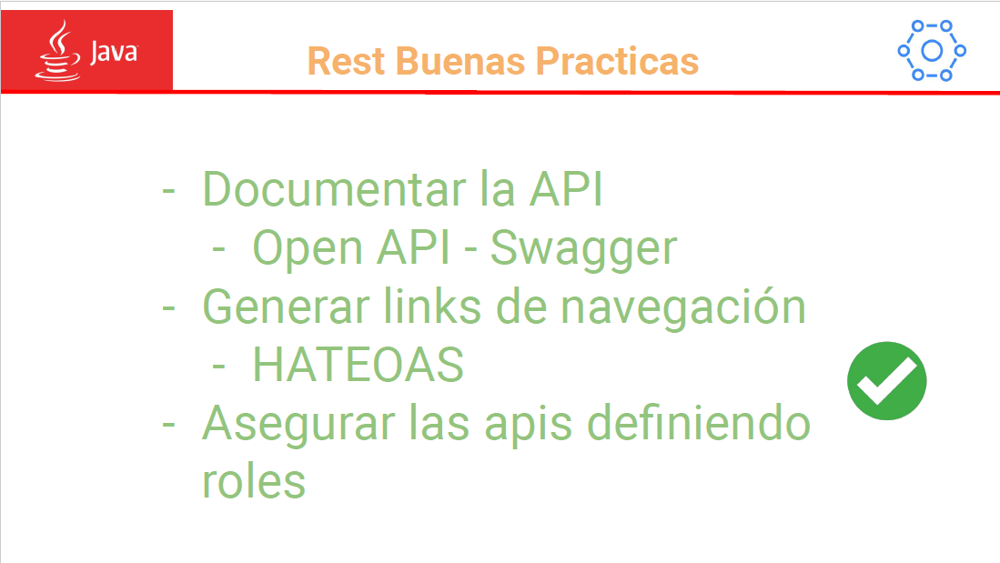

# Curso de Microservicios Escuela IT

# Clase 1. Arquitectura de microservicios y Rest API 

## Índice
- ...
- ...

## ...

## Lombok

## Crear un controlador con un CRUD
1. Creamos una clase y le ponemos la anotación @RestController para exponer esta clase con un endpoint

```java
package es.edu.escuela_it.Miroservices.controller;

import org.springframework.web.bind.annotation.RestController;

@RestController
public class UsersControllerRest {

}
```

2. GET{param}. Creamos un servicio para recuperar un usuario por id, para ello basta simplemente 
con ponerle la anotración @GetMapping al método que queremos exponer como servio.

```java
@RestController
public class UsersControllerRest {

	@GetMapping("/users/{id}")
	public UserDTO getUserById(@PathVariable int id) {
		
		System.out.println("Recovery user by id");
		
		UserDTO userDTO = new UserDTO(1, "Jesús");
		userDTO.setAge(33);
		userDTO.setLastName("Romero Vidal");
		
		return userDTO;
	}
}
```
puntualizar que de momento solo hemos hardcodeado el usuario que estamos devolviendo en la llamada a este servicio.
A la anotacion @GetMapping le pasamos como parámetro la ruta donde se expondrá este serrvicio. Es buena práctica ponerle a la ruta el mismo nombre que la clase del modelo, "users". Después de la ruta le hemos pasado un **URI Template Variable** "{id}", de esta forma es como indicamos que será un parámetro variable de la ruta.

Para recibir esta **URI Template Variable** es necesario utilizar la anotación @PathVariable en los argumentos del método. Si el nombre del parámetro de la ruta y el argumento del método coinciden basta con poner esta anotación simple, de otra forma tendriamos que espcificar el mapeo en la anotación tla que así:

```java
@RestController
public class UsersControllerRest {

	@GetMapping("/users/{id}")
	public UserDTO getUserById(@PathVariable("id") int userId) {
		
		System.out.println("Recovery user by id");
		
		UserDTO userDTO = new UserDTO(1, "Jesús");
		userDTO.setAge(33);
		userDTO.setLastName("Romero Vidal");
		
		return userDTO;
	}
}
```
3. Spring internamente convierte el objeto devuelto a JSOn haciendo uso de Jackson, por lo que no tenemos que procuparnor
por parsear entre Java y JSON. Esta es la salida del navegador ya en formato JSON:


4. GET. Creamos un segundo servicio para devolver todos los usuarios. Observad como con las anotaciones también hay sobreescritura, pues estamos creando don GET poro sus parámetros de ruta son diferentes ("/users/{id}" != "/users") por lo que tienen tipo diferente y no colisionan

```java
@RestController
public class UsersControllerRest {

	@GetMapping("/users/{id}")
	public UserDTO getUserById(@PathVariable int id) {
		
		System.out.println("Recovery user by id");
		
		UserDTO userDTO = new UserDTO(1, "Jesús");
		userDTO.setAge(33);
		userDTO.setLastName("Romero Vidal");
		
		return userDTO;
	}
	
	@GetMapping("/users")
	public List<UserDTO> listAllUsers() {
		List<UserDTO> list = List.of(new UserDTO(1, "Jesús"), new UserDTO(2, "Miguel"), new UserDTO(3, "Álvaro"));
		return list;
	}
}
```
5. POST. Creamos un recuros con el verbo POST. También es buena práctica ponerlo en la misma ruta que los métodos get "/users", que es el nombre del modelo que estamos alterando

```java
	@PostMapping("/users")
	public String createUser(@RequestBody UserDTO userDTO) {
		
		System.out.println("Creating user" + userDTO.getId());
		
		return "http://localhost:8080/users/" + userDTO.getId();
	}
```

Es buena práctica devolver la uri en la que se acaba de crear el recurso.
Para crear el usuario necesitamos que nos lo envíen desde el lado del cliente suministrandolo en el payLoad de la llamada, el body.
Para recibir por parámetro un body de una peticion hhtp necesitamos indicarlo con la anotación @RequestBody. el body llega como un JSON pero aquí Spring hace la operacion reversa, parsea el JSON al objeto UserDTO de Java.

6. Comenzamos a usar Postman para poder enviar un body a los métodos que lo necesiten como el POST.
7. PUT. modificamos un recurso con el verbo PUT. PUT se utiliza cuando queramos modificar un recurso en su totalidad. Cuando hacemos un update es bueno devolver el recurso modificado.

```java
	@PutMapping("/users")
	public UserDTO updateUser(UserDTO userDTO) {
		
		System.out.println("Updating data");
		
		return userDTO;
	}
```

8. DELETE. Eliminar un usuario por id.

```java
	@DeleteMapping("/users/{id}")
	public void deleteUser(@PathVariable int id) {
		
		System.out.println("Delete user by id");
		
	}
```

9. PATCH. actualización parcial de ciertos atributos.

```java
    @PatchMapping(value = "/users/{id}")
    public UserDTO updateAge(Map<String,Object> attributes, @PathVariable("id") String id) {
        UserDTO userDTO = new UserDTO();

        //Logica aquí

        return userDTO;
}
```
10. GET con QUERY FILTER. Filtrar una consultaget con parámetros.

```java
    @GetMapping("/users")
    public List<UserDTO> listAllUsers( @RequestParam(required = false) String name,
                                    @RequestParam(required = false) String lastName,
                                    @RequestParam(required = false) Integer age) {

        List<UserDTO> list = List.of(new UserDTO(1, "Rafael"), new UserDTO(2, "Miguel"), new UserDTO(3, "Alvaro"));

        //lógica de filtrado:
        list = list.stream().filter(u -> u.getName().contains(name)).collect(Collectors.toList());
        return list;
    }
```
esto parámetros llegaria mediante la url por medio de query params:


# Clase 2. Capa controller, Swagger y HATEOAS.
## Índice.
1. Cómo cambiar el puerto donde escucha la aplicación.
2. Cómo cambiar la URI base (ej: localhost:8080).
3. Cómo unificar rutas por controller.
4. Cómo configurar los códigos de respuesta.
5. Anidación de recursos.
5. Buenas prácticas.
6. Externalización de parámetros.
7. Documentación REST con Swagger
8. Navegación REST con HATEOAS.

## Cómo cambiar el puerto donde escucha la aplicación
Nos dirigimos al archivo application.properties e introducimos una linea especificando el puerto donde escucha por defecto:

```
server.port=8081
```

## Cómo cambiar la URI base (ej: localhost:8080)
Nos dirigimos al archivo application.properties e introducimos una linea especificando el URI base para todos los microservicios.
importante que el base URI contenga la organización/api/version/conjuntoDeEndpoints

```
server.servlet.context-path=/escuelait/api/v2/microservices
```
incluimos la nueva base URI en las variables de entorno de postman y comprobamos que sigue funcionando correctamente:


## Cómo unificar rutas por controller

ponemos la siguiente anotación a la clase controller y ya no necesitaremos indicarla en cada método:

@RequestMapping("/users")

```java
@RestController
@RequestMapping("/users")
public class UsersControllerRest {

	@GetMapping("/{id}")
	public UserDTO getUserById(@PathVariable int id) {
		
		System.out.println("Recovery user by id");
		
		UserDTO userDTO = new UserDTO(1, "Jesús");
		userDTO.setAge(33);
		userDTO.setLastName("Romero Vidal");
		
		return userDTO;
	}
	
	@GetMapping
	public List<UserDTO> listAllUsers() {
		List<UserDTO> list = List.of(new UserDTO(1, "Jesús"), new UserDTO(2, "Miguel"), new UserDTO(3, "Álvaro"));
		return list;
	}
	
	@PostMapping
	public String createUser(@RequestBody UserDTO userDTO) {
		
		System.out.println("Creating user" + userDTO.getId());
		
		return "http://localhost:8080/users/" + userDTO.getId();
	}
	
	@PutMapping
	public UserDTO updateUser(@RequestBody UserDTO userDTO) {
		
		System.out.println("Updating data");
		
		return userDTO;
	}
	
	@DeleteMapping("/{id}")
	public void deleteUser(@PathVariable int id) {
		
		System.out.println("Delete user by id");
		
	}
	
}
```

## Cómo configurar los códigos de respuesta.

Para configurar los códigos de respuesta utilizaremos en cada método el generic ResponseEntity \<T> que envuelve al objeto que devulve el método. al retornar el ResponseEntity envolviendo al objeto devolvemos el objeto mas información adicional.

Hay varias formas de devolver el código de error, de momento nos centramos en una de ellas que es mediante un método estático de la clase ResponseEntity

### Respuesta OK:
#### GET --> 200 ok

antes:

```java
	@GetMapping("/{id}")
	public UserDTO getUserById(@PathVariable int id) {
		
		System.out.println("Recovery user by id");
		
		UserDTO userDTO = new UserDTO(1, "Jesús");
		userDTO.setAge(33);
		userDTO.setLastName("Romero Vidal");
		
		return userDTO;
	}
```
Después:

```java
@GetMapping("/{id}")
	public ResponseEntity<UserDTO> getUserById(@PathVariable int id) {
		
		System.out.println("Recovery user by id");
		
		UserDTO userDTO = new UserDTO(1, "Jesús");
		userDTO.setAge(33);
		userDTO.setLastName("Romero Vidal");
		
		return ResponseEntity.ok(userDTO);
	}
```

otro ejemplo coin GET:

```java
	@GetMapping
	public ResponseEntity<List<UserDTO>> listAllUsers() {
		List<UserDTO> list = List.of(new UserDTO(1, "Jesús"), new UserDTO(2, "Miguel"), new UserDTO(3, "Álvaro"));
		return ResponseEntity.ok(list);
	}
```
#### POST -> 201 created
Este es algo más complajo. es buena práctica devolver la ruta donde se puede encontrar el recurso creado pero no es buena práctica hacerlo hardcodeado como lo tenemos ahora. Por lo que tenemos que usar la clase ServletUriComponentsBuilder que nos permite crear links basados en la httpsServerletRequest actual

antes:
```java
	@PostMapping
	public String createUser(@RequestBody UserDTO userDTO) {
		
		System.out.println("Creating user" + userDTO.getId());
		
		return "http://localhost:8080/users/" + userDTO.getId();
	}
```

después:
```java
	@PostMapping
	public ResponseEntity<String> createUser(@RequestBody UserDTO userDTO) {
		
		System.out.println("Creating user" + userDTO.getId());
		
		URI location = ServletUriComponentsBuilder.
				fromCurrentRequest()
				.path("/{id}")
				.buildAndExpand(userDTO.getId())
				.toUri();
		
		return ResponseEntity.created(location).build();
	}
```
#### PUT -> 200 ok
```java
	@PutMapping
	public ResponseEntity<UserDTO> updateUser(@RequestBody UserDTO userDTO) {
		
		System.out.println("Updating data");
		
		return ResponseEntity.ok(userDTO);
	}
```
#### DELETE -> 200 ok
aquí devolvemos un paremetrizado con null porque el método no devolvía nada, es void:
antes:
```java
	@DeleteMapping("/{id}")
	public void deleteUser(@PathVariable int id) {
		
		System.out.println("Delete user by id");
		
	}
```
después:
```java
@DeleteMapping("/{id}")
	public ResponseEntity<Void> deleteUser(@PathVariable int id) {
		
		System.out.println("Delete user by id");
		
		return ResponseEntity.ok(null);
	}
```

### Respuesta 404 NOT FOUND:
#### GET --> 404 NOT FOUND
forzamos un codigo de respuesta NOT FOUND y devolvemos la respuesta http con ResponseEntity.notFound().build()
```java
	@GetMapping("/{id}")
	public ResponseEntity<UserDTO> getUserById(@PathVariable int id) {
		
		System.out.println("Recovery user by id");
		
		UserDTO userDTO = null; //new UserDTO(1, "Jesús");
		//userDTO.setAge(33);
		//userDTO.setLastName("Romero Vidal");
		
		if(userDTO == null) {
			return ResponseEntity.notFound().build();
		}
		
		return ResponseEntity.ok(userDTO);
	}
```

### Anidación de recursos
Cuando una entidad como Users tiene relaciones 1-n con otras entidades como por ejemplo accounts, existen varias formas de recuperar la lista de accounts a partir del user pero, solo una de ellas se considera una buena práctica.

Esta es la forma correcta de recuperar todas las cuentas de un usuario. Primero en la ruta se accede al usuario y después a las cuentas:

```java
	@GetMapping("/{id}/accounts")
	public ResponseEntity<List<AccountDTO>> getUserAccounts(@PathVariable int id) {
		
		List<AccountDTO> list = List.of(new AccountDTO("Google"), new AccountDTO( "Twitter"), new AccountDTO("Escuela IT"));
		
		return ResponseEntity.ok(list);
	}
```

se considera mala práctica recuperar este recurso escribiendo al url con query param así:
http://localhost.com/users/accounts?id=...

otro ejemplo es que necesitemos para un usuario específico solo una cuenta en específico:

```java
	@GetMapping("/{id}/accounts/{idAccount}")
	public ResponseEntity<AccountDTO> getUserAccountById(@PathVariable int id, @PathVariable int idAccount) {
		
		AccountDTO account = new AccountDTO("Google");
		
		return ResponseEntity.ok(account);
	}
```

En este ultimo ejemplo la forma correcta es indicar en la url el usuario concreto copn su id para luego acceder al recurso Account con su id también. en este punto podríamos preguntarnos porqué no acceder directamete con Account{id} si este es un id único entre todas las cuentas... La respuesta es que según el estandar REST se debería acceder recurso a recurso "/{id}/accounts/{idAccount}" así tenemos en cuenta aquellas API que no tienen un identificador unico para cada recurso sino una combinacion de id de User y Account, por ejemplo:

User 1 - Account 1
User 1 - Account 2
User 1 - Account 3
User 2 - Account 1
User 2 - Account 2
User 2 - Account 3

Un caso diferente es como utilizar un endpooint para crear un recurso anidado--no solo recuperar recursos anidados como antes.
en Este caso deberiamos tener un controlador de Account con el CRUD de Account. Entonces en el método create de este recurso se haría dos llamadas, una para recuperar el usuario y otra para crear una cuenta que pertenezca al usuario recuperado previamente.

Hay mucha confusión sobre hasta donde llegar con el anidamiento. Una buena práctica es recuperar--Read- un segundo recurso a partir del primero pero, cuando ya queremos hacer otras operaciones CRUD--diferentes a simples lecturas--  es mejor hacer un split y generar un API REST (controladorREST) especificamente de Account.

### Buenas prácticas.
#### REST es orientado a recursos

#### Concatenación de recursos

#### Otros





### Externalización
#### Externalización: @Value
nos interesa guardar configuraciones que sean modificables en el futuro een un archivo de configuración .properties, para separarlo del código de la aplicación. Ya que en nuestro código no queremos hardcodear nada que sea susceptible de cambio en el futuro.

Para acceder a esta configuración lo haremos por medio de una clase java decorada con la anotación de Spring @configuration para convertir la clase en un Bean de configuración de Spring que nos da la capacidad de guardar los valores de los archivos de configuracióhn en los atributos de la clase.

primero creamos el paquete confiration y creamos una clase ApplicationConfig.

```java
package es.edu.escuela_it.Miroservices.configuration;

import org.springframework.context.annotation.Configuration;

@Configuration
public class ApplicationConfig {

}
```

incluimos lo siguiente en el archivo de application.properties

```
spring.application.name=Miroservices Java Classes
app.year=2020
app.edition=Community
app.countries=es,ar,it,ca,br
```

La anotacion @Configuration lo que hace es incorporar esta clase en el contenedor de dependecias de Spring, en el core.

Por otro lado la anotación @Value rescata el valor del archivo application.properties y lo asigna al atributo

```java
package es.edu.escuela_it.Miroservices.configuration;

import org.springframework.beans.factory.annotation.Value;
import org.springframework.context.annotation.Configuration;

import lombok.Data;

@Configuration
@Data
public class ApplicationConfig {

	@Value("${spring.application.name}")
	private String name;
	
	@Value("${app.year}")
	private int year;
	
	@Value("${app.edition}")
	private String edition;
	
	@Value("${app.countries}")
	private String[] countries;
	
}
```

Ahora probaremos a recuperar estos valores desde la clase controladora HolaMundo. Creamos un atributo que contendrá el objeto ApplicationConfig y lo anotamos con @Autowired. @Autowired solicita al Core de dependencias de Spring el objeto ApplicationConfig y Spring va a fabricar por nosotros este objeto. Lo hacemos así, porque al crear el objeto Spring en vez de notros con un new, Spring lo va  a construir incorparando ya los valores en los atributos anotados con @Value.

```java
package es.edu.escuela_it.Miroservices.controller;

import org.springframework.beans.factory.annotation.Autowired;
import org.springframework.web.bind.annotation.GetMapping;
import org.springframework.web.bind.annotation.RestController;

import es.edu.escuela_it.Miroservices.configuration.ApplicationConfig;

@RestController
public class HolaMundoRest {

	@Autowired
	private ApplicationConfig appConfig;
	
	@GetMapping("/holaMundo")
	public String saludo() {
		System.out.println(this.appConfig.toString());
		return "Hola Mundo servicio Rest Java";
	}
}
```

comprobamos como al hcer la llamada rest /holaMundo nos imprime por consola
las propiedades que ha rescatado del archivo de congiguración:
```
ApplicationConfig(name=Miroservices Java Classes, year=2020, edition=Community, countries=[es, ar, it, ca, br])
```

#### Externalización: @ConfigurationProperties Prefix
Anotación para normalizar prefijos. Si el atributo tiene el mismo nombre que el sufijo de la propiedad deberemos de quitar las anotaciones @Value

```java
package es.edu.escuela_it.Miroservices.configuration;

import org.springframework.beans.factory.annotation.Value;
import org.springframework.boot.context.properties.ConfigurationProperties;
import org.springframework.context.annotation.Configuration;

import lombok.Data;

@Configuration
@Data
@ConfigurationProperties(prefix = "app")
public class ApplicationConfig {

	@Value("${spring.application.name}")
	private String name;
	
	private int year;
	
	private String edition;
	
	private String[] countries;
	
}
```

### Documentación con Swagger
#### Swagger: Setup
Necesitmaos incorporar springdoc-openapi-starter-webmvc-ui como dependencia en el pom.xml
```xml
	<dependency>
		<groupId>org.springdoc</groupId>
		<artifactId>springdoc-openapi-starter-webmvc-ui</artifactId>
		<version>2.0.3</version>
	</dependency>
```

Creamnos una clase de configuración llamada OpenAPIConfig
que será un Bean que configura Swagger en el arranque del proyecto
y añadimos algunos datos de carátula
+info: https://www.bezkoder.com/spring-boot-swagger-3/

```java
package es.edu.escuela_it.Miroservices.configuration;

import java.util.List;

import org.springframework.beans.factory.annotation.Value;
import org.springframework.context.annotation.Bean;
import org.springframework.context.annotation.Configuration;

import io.swagger.v3.oas.models.OpenAPI;
import io.swagger.v3.oas.models.info.Contact;
import io.swagger.v3.oas.models.info.Info;
import io.swagger.v3.oas.models.info.License;
import io.swagger.v3.oas.models.servers.Server;

@Configuration
public class OpenAPIConfig {

	@Value("${openapi.dev-url}")
	  private String devUrl;

	  @Value("${openapi.prod-url}")
	  private String prodUrl;

	  @Bean
	  public OpenAPI myOpenAPI() {
	    Server devServer = new Server();
	    devServer.setUrl(devUrl);
	    devServer.setDescription("Server URL in Development environment");

	    Server prodServer = new Server();
	    prodServer.setUrl(prodUrl);
	    prodServer.setDescription("Server URL in Production environment");

	    Contact contact = new Contact();
	    contact.setEmail("jesus.romerovidal@gmail.com");
	    contact.setName("Jesús");
	    contact.setUrl("https://github.com/js-rom");

	    License mitLicense = new License().name("MIT License").url("https://choosealicense.com/licenses/mit/");

	    Info info = new Info()
	        .title("Users Management API")
	        .version("2.0")
	        .contact(contact)
	        .description("This API exposes endpoints to manage users accounts.").termsOfService("https://www._.com/terms")
	        .license(mitLicense);

	    return new OpenAPI().info(info).servers(List.of(devServer, prodServer));
	    
	  }
}

```

link de acceso a la UI de swagger de nuestro proyecto: 
http://localhost:8080/escuelait/api/v2/microservices/swagger-ui/index.html#/

### Swagger. Models Annotation

utilizamos la anotación @Schema

```java
package es.edu.escuela_it.Miroservices.model;

import org.springframework.hateoas.RepresentationModel;

import io.swagger.v3.oas.annotations.media.ExampleObject;
import io.swagger.v3.oas.annotations.media.Schema;
import lombok.Data;
import lombok.EqualsAndHashCode;
import lombok.ToString;


@Data
@EqualsAndHashCode(callSuper = true)
@Schema(description = "Details about the user")
public class UserDTO extends RepresentationModel<UserDTO> {
	
	
	@Schema(description = "The unique ID of the user", example = "1", requiredMode = Schema.RequiredMode.REQUIRED)
	@lombok.NonNull
	private int id;
	
	@Schema(description = "Name of the user", example = "Jesús")
	@lombok.NonNull
	private String name;
	
	@Schema(description = "Last name of the user", example = "Romero")
	private String lastName;
	
	@Schema(description = "Age of the user", example = "33")
	@ToString.Exclude
	private int age;

}
```
 

### Swagger. Endpoints Annotations
anotaciones utilizadas:
- @Tag
- @Operation
- @ ApiResponses
- @ApiResponse

```java
//Swagger:
@Tag(name = "Users", description = "the Users Api")
public class UsersControllerRest {

	public ResponseEntity<UserDTO> getUserById(@PathVariable int id) {

		System.out.println("Recovery user by id");

		UserDTO userDTO = new UserDTO(1, "Jesús");
		userDTO.setAge(33);
		userDTO.setLastName("Romero Vidal");

		Link withSelfRel = linkTo(methodOn(UsersControllerRest.class).getUserById(userDTO.getId())).withSelfRel();
		userDTO.add(withSelfRel);

		return ResponseEntity.ok(userDTO);
	}

	@Operation(summary = "Fetch all users", description = "fetches all users entities and their data from data source")
	@ApiResponses(value = { @ApiResponse(responseCode = "200", description = "successful operation") })
	@GetMapping
	public ResponseEntity<CollectionModel<UserDTO>> listAllUsers() {

		List<UserDTO> list = List.of(new UserDTO(1, "Jesús"), new UserDTO(2, "Miguel"), new UserDTO(3, "Álvaro"));

		for (UserDTO userDTO : list) {

			Link withSelfRel = linkTo(methodOn(UsersControllerRest.class).getUserById(userDTO.getId())).withSelfRel();
			userDTO.add(withSelfRel);

			Link accountsRel = linkTo(methodOn(UsersControllerRest.class).getUserAccounts(userDTO.getId()))
					.withRel("accounts");
			userDTO.add(accountsRel);
		}
```
 

### Swagger. Separar implementacion de documentación.

Podemos poner toda las anotaciones de swagger es una interfaz
e implementar esta interfaz desde el endpoin o el modelo.


### Hateoas. Navegación de la API.
#### Hateoas. Setup
Primero incorporamos la dependencia al pom.xml
```xml
<dependency>
    <groupId>org.springframework.boot</groupId>
    <artifactId>spring-boot-starter-hateoas</artifactId>
</dependency>
```
#### Hateoas. Navegación self resource
Los modelos deben extender de RepresentationModel\<Model>
```java
public class UserDTO extends RepresentationModel<UserDTO> {
    //… 
}
```
Por otro lado, en la clase controller hacemos los siguientes import:

```java
import org.springframework.hateoas.Link;
import static org.springframework.hateoas.server.mvc.WebMvcLinkBuilder.linkTo;
import static org.springframework.hateoas.server.mvc.WebMvcLinkBuilder.methodOn;
```

en cada método utilizariamos el siguiente código para conseguir la nevegacioón consigo mismo, es decir un endpoint GET además de devolver un recurso debe proveer información (link) de donde se encuentra este mismo recurso.

```java
Link withSelfRel =
linkTo(methodOn(UsersControllerRest.class).getUserById(userDTO.getId())).withSelfRel();
userDTO.add(withSelfRel);
```

ejemplo:
```java
	@GetMapping("/{id}")
	public ResponseEntity<UserDTO> getUserById(@PathVariable int id) {

		System.out.println("Recovery user by id");

		UserDTO userDTO = new UserDTO(1, "Jesús");
		userDTO.setAge(33);
		userDTO.setLastName("Romero Vidal");

		Link withSelfRel = linkTo(methodOn(UsersControllerRest.class).getUserById(userDTO.getId())).withSelfRel();
		userDTO.add(withSelfRel);

		return ResponseEntity.ok(userDTO);
	}
```
vemos como nos devuelve el link en la respuesta:


#### Hateoas. Navegación self list
En el método listAllUsers() antes devolvíamos una List de usuarios. ahora devolvemos un objebto CollectionModel de Hateoas que envuelve a la lista de usuarios

```java
	@GetMapping
	public ResponseEntity<CollectionModel<UserDTO>> listAllUsers() {
		
		List<UserDTO> list = List.of(new UserDTO(1, "Jesús"), new UserDTO(2, "Miguel"), new UserDTO(3, "Álvaro"));
		
		Link link = linkTo(methodOn(UsersControllerRest.class).listAllUsers()).withSelfRel();
		CollectionModel<UserDTO> result = CollectionModel.of(list, link);
		return ResponseEntity.ok(result);
		
		//return ResponseEntity.ok(list);
	}
```

en la respues ahora podemos como por una parte devuelve la lista de users y por otra parte el link donde encontrar el recurso users que devuelve la lista:


Lo mas apropiado sería que cada uno de los objetos users que devuelve la lista tuviese un link donde encontrar ese recurso concreto. Lo conseguimos con el siguiente código:
```java
	@GetMapping
	public ResponseEntity<CollectionModel<UserDTO>> listAllUsers() {
		
		List<UserDTO> list = List.of(new UserDTO(1, "Jesús"), new UserDTO(2, "Miguel"), new UserDTO(3, "Álvaro"));
		
		for	(UserDTO userDTO : list) {
			Link withSelfRel = linkTo(methodOn(UsersControllerRest.class).getUserById(userDTO.getId())).withSelfRel();
			userDTO.add(withSelfRel);
		}
		
		Link link = linkTo(methodOn(UsersControllerRest.class).listAllUsers()).withSelfRel();
		CollectionModel<UserDTO> result = CollectionModel.of(list, link);
		return ResponseEntity.ok(result);
		
		//return ResponseEntity.ok(list);
	}
```

Observamos como hemos utilizado el códico de Navegación self resource para añadir el link a cada recurso concreto UsersDTO


#### Hateoas. Navegación inter-resource

Estaría bien devolver junto con el link a cada usuario otros link a las todas las entidades relacionadas con el usuario como Accounts. ahora no indicamo withSelfRel() sino la relación a la otra entidad con withRel("accounts")

```java
@GetMapping
	public ResponseEntity<CollectionModel<UserDTO>> listAllUsers() {

		List<UserDTO> list = List.of(new UserDTO(1, "Jesús"), new UserDTO(2, "Miguel"), new UserDTO(3, "Álvaro"));

		for (UserDTO userDTO : list) {

			Link withSelfRel = linkTo(methodOn(UsersControllerRest.class).getUserById(userDTO.getId())).withSelfRel();
			userDTO.add(withSelfRel);

			Link accountsRel = linkTo(methodOn(UsersControllerRest.class).getUserAccounts(userDTO.getId()))
					.withRel("accounts");
			userDTO.add(accountsRel);
		}

		Link link = linkTo(methodOn(UsersControllerRest.class).listAllUsers()).withSelfRel();
		CollectionModel<UserDTO> result = CollectionModel.of(list, link);
		return ResponseEntity.ok(result);

	}
```

la respuesta quedaría así:


# Clase 3.
## Indice.
- Validación

### Validacion
Especificación: Bean Validation 2.0 (JSR 380)
#### Validación. Setup.
incluimos en el pom.xml la siguiente dependencia

```xml
		<dependency>
			<groupId>org.springframework.boot</groupId>
			<artifactId>spring-boot-starter-validation</artifactId>
		</dependency>
```
#### Validación. Anotaciones.


#### Validación. Cómo usarlo.
incorporamos en el modelo UserDTO las anotaciones/restricciones de cada atributo. Por ejemplo,
indicamos que el atributo id no puede ser nulo con @NotNull:

OJO!! en Java, los tipos de datos primitivos como **int** no pueden ser **null** ya que 
siempre tienen un valor por defecto, en este caso de **0**. Si un campo de nuestro modelo 
tuviese tipo int no podríamos validarlo con @NotNull ya que si enviamo un null en el body 
automaticamente java va a poner el valor por defecto de 0. Asi que para validar que un campo
integer no puede ser null debemos de usar el wrapper Integer que si admite valores null. 

```java
package es.edu.escuela_it.Miroservices.model;

import java.time.LocalDate;

import org.springframework.hateoas.RepresentationModel;

import io.swagger.v3.oas.annotations.media.Schema;
import jakarta.validation.constraints.AssertFalse;
import jakarta.validation.constraints.AssertTrue;
import jakarta.validation.constraints.Email;
import jakarta.validation.constraints.FutureOrPresent;
import jakarta.validation.constraints.Max;
import jakarta.validation.constraints.Min;
import jakarta.validation.constraints.NotBlank;
import jakarta.validation.constraints.NotNull;
import jakarta.validation.constraints.Past;
import jakarta.validation.constraints.Positive;
import jakarta.validation.constraints.Size;
import lombok.Data;
import lombok.EqualsAndHashCode;
import lombok.ToString;


@Data
@EqualsAndHashCode(callSuper = true)
@Schema(description = "Details about the user")
public class UserDTO extends RepresentationModel<UserDTO> {
	
	
	@Schema(description = "The unique ID of the user", example = "1", requiredMode = Schema.RequiredMode.REQUIRED)
	@lombok.NonNull
	@NotNull // jakarta.validation
	private Integer id;
	
	@Schema(description = "Name of the user", example = "Jesús")
	@lombok.NonNull
	@NotBlank() // jakarta.validation
	private String name;
	
	@Schema(description = "Last name of the user", example = "Romero")
	@Size(min = 6, max = 20) // jakarta.validation
	private String lastName;
	
	@Schema(description = "Age of the user", example = "33")
	@ToString.Exclude
	@NotNull // jakarta.validation
	@Positive // jakarta.validation
	@Min(18) // jakarta.validation
	@Max(90) // jakarta.validation
	private Integer age;
	
	@Email
	private String email;
	
	@AssertTrue // jakarta.validation
	// @AssertFalse // jakarta.validation
	private boolean active;
	
	@Past // jakarta.validation
	// @FutureOrPresent // jakarta.validation
	private LocalDate birthday;
	
}
```

por otro lado, en el endpoint anotamos en el parámetro del método que va a recibir un
JSON que se de validar con @Valid

```java
@PostMapping

	public ResponseEntity<String> createUser(@Valid @RequestBody UserDTO userDTO) { //@Valid jakarta.validation

		System.out.println("Creating user" + userDTO.getId());

		URI location = ServletUriComponentsBuilder.fromCurrentRequest().path("/{id}").buildAndExpand(userDTO.getId())
				.toUri();

		return ResponseEntity.created(location).build();
	}
```

Con estas validaciones si no enviamos un Json correcto el navegador nos devuelve
un codigo de error 400 BAD REQUEST y Java imprime por consola un error de validación.
Lo correcto es enviar al navegador un código de error lo más descriptivo posible
para dar información al cliente que está consumiendo la API de qué campos ha introducido
mal.

#### Validación. Enviar mensajes de error en la respuesta http de los endpoints.

En el siguiente apartado veremos como personalizar y externalizar estos mensajes pero,
primero vamos a ver como **enviar mensajes de error en la respuesta http de los endpoints**.

creamos un paquete errors y creamos una clase java con el siguiente código, que es el java necesario
poder mostrar un mensaje de error en el cliente:
```java
package es.edu.escuela_it.Miroservices.errors;

import java.util.List;
import org.springframework.http.HttpStatus;
import lombok.AllArgsConstructor;
import lombok.Data;

@Data
@AllArgsConstructor
public class ApiError {
	private HttpStatus status;
	private String message;
	private List<String> errors;
}
```
tambien necesitamos la siguiente clase que es la que va a interceptar los errores que se 
produzcan en spring, va a popular la clase ApiError y reenvia 
ApiError en la respuesta al cliente.

```java
package es.edu.escuela_it.Miroservices.errors;

import java.util.ArrayList;
import java.util.List;
import org.springframework.http.HttpHeaders;
import org.springframework.http.HttpStatus;
import org.springframework.http.ResponseEntity;
import org.springframework.validation.FieldError;
import org.springframework.validation.ObjectError;
import org.springframework.web.bind.MethodArgumentNotValidException;
import org.springframework.web.bind.annotation.ControllerAdvice;
import org.springframework.web.context.request.WebRequest;
import org.springframework.web.servlet.mvc.method.annotation.ResponseEntityExceptionHandler;

@ControllerAdvice
public class CustomRestExceptionHandler extends ResponseEntityExceptionHandler {
	
	protected ResponseEntity<Object> handleMethodArgumentNotValid(MethodArgumentNotValidException ex,
			HttpHeaders headers, HttpStatusCode status, WebRequest request) {
		List<String> errors = new ArrayList<String>();
		for (FieldError error : ex.getBindingResult().getFieldErrors()) {
			errors.add(error.getField() + ": " + error.getDefaultMessage());
		}
		for (ObjectError error : ex.getBindingResult().getGlobalErrors()) {
			errors.add(error.getObjectName() + ": " + error.getDefaultMessage());
		}
		ApiError apiError = new ApiError(HttpStatus.BAD_REQUEST, ex.getMessage(), errors);
		return handleExceptionInternal(ex, apiError, headers, apiError.getStatus(), request);
	}
}
```

Ahora en el cliente, en el body de la respuesta recibimos un array de errores en la llamada:

```Json
{
    "status": "BAD_REQUEST",
    "message": "Validation failed for argument [0] in public org.springframework.http.ResponseEntity<java.lang.String> es.edu.escuela_it.Miroservices.controller.UsersControllerRest.createUser(es.edu.escuela_it.Miroservices.model.UserDTO) with 3 errors: [Field error in object 'userDTO' on field 'age': rejected value [14]; codes [Min.userDTO.age,Min.age,Min.java.lang.Integer,Min]; arguments [org.springframework.context.support.DefaultMessageSourceResolvable: codes [userDTO.age,age]; arguments []; default message [age],18]; default message [debe ser mayor que o igual a 18]] [Field error in object 'userDTO' on field 'active': rejected value [false]; codes [AssertTrue.userDTO.active,AssertTrue.active,AssertTrue.boolean,AssertTrue]; arguments [org.springframework.context.support.DefaultMessageSourceResolvable: codes [userDTO.active,active]; arguments []; default message [active]]; default message [debe ser verdadero]] [Field error in object 'userDTO' on field 'email': rejected value [asdasd]; codes [Email.userDTO.email,Email.email,Email.java.lang.String,Email]; arguments [org.springframework.context.support.DefaultMessageSourceResolvable: codes [userDTO.email,email]; arguments []; default message [email],[Ljakarta.validation.constraints.Pattern$Flag;@3da2ca0b,.*]; default message [debe ser una dirección de correo electrónico con formato correcto]] ",
    "errors": [
        "age: debe ser mayor que o igual a 18",
        "active: debe ser verdadero",
        "email: debe ser una dirección de correo electrónico con formato correcto"
    ]
}
```

#### Validación. Personalizar y externalizar mensajes de error.

A cada una de las anotaciones de validación podemos especificarles un mensaje de error para sobreescribir
los mensajes por defecto que salen por consola, por ejemplo:

```java
@NotBlank(message = "Error, el nombre debe tener al menos un caracter")
//....
```
Esta forma de pesonalizar los mensajes no es adecuada ya que estamos hardcodeando en el código los mensajes.
Es buena práctica externalizarlos en un archivo .properties

primero. Añadimo un nuevo archivo de configuración messages.properties

incorporamos algunos claves-valor con mensajes en el archivo de cofiguracion:
```
app.field.birth_day.error=Fecha de cumple erronea
app.field.active.error=Solo puede ser verdadero
```

segundo. Añadimos una nuva clase a configuration que leerá el archivo de configuración
messages.properties y configurara el mensaje de cada campo

```java
package es.edu.escuela_it.Miroservices.configuration;

import java.util.Locale;
import org.springframework.context.MessageSource;
import org.springframework.context.annotation.Bean;
import org.springframework.context.annotation.Configuration;
import org.springframework.context.support.ReloadableResourceBundleMessageSource;
import org.springframework.validation.beanvalidation.LocalValidatorFactoryBean;
import org.springframework.web.servlet.config.annotation.InterceptorRegistry;
import org.springframework.web.servlet.config.annotation.WebMvcConfigurer;
import org.springframework.web.servlet.i18n.LocaleChangeInterceptor;
import org.springframework.web.servlet.i18n.SessionLocaleResolver;

@Configuration
public class ResourceMessageConfiguration implements WebMvcConfigurer {
	/**
	 * Establece un archivo de mensajes por default
	 */
	@Bean
	public MessageSource messageSource() {
		ReloadableResourceBundleMessageSource messageSource = new ReloadableResourceBundleMessageSource();
		messageSource.setBasename("classpath:messages");
		messageSource.setDefaultEncoding("UTF-8");
		return messageSource;
	}

	/*
	 * Proporciona la posibilidad de que los mensajes de los validator accedan al
	 * archivo de claves message
	 */
	@Bean
	public LocalValidatorFactoryBean validator(MessageSource messageSource) {
		LocalValidatorFactoryBean bean = new LocalValidatorFactoryBean();
		bean.setValidationMessageSource(messageSource);
		return bean;
	}

	/*
	 * Establece un locale por default
	 */
	@Bean
	public SessionLocaleResolver localeResolver() {
		SessionLocaleResolver localeResolver = new SessionLocaleResolver();
		localeResolver.setDefaultLocale(Locale.ENGLISH);
		return localeResolver;
	}

	/*
	 * Permite cambiar el local en cada llamada por el param lang
	 */
	@Bean
	public LocaleChangeInterceptor localeChangeInterceptor() {
		LocaleChangeInterceptor lci = new LocaleChangeInterceptor();
		lci.setParamName("lang");
		return lci;
	}

	@Override
	public void addInterceptors(InterceptorRegistry registry) {
		registry.addInterceptor(localeChangeInterceptor());
	}
}

```

tercero. En las anotaciones de validación de UserDTO indicamos la clave que contiene el mensaje,
por ejemplo:

```java
	@AssertTrue(message="{app.field.active.error}") // jakarta.validation
	// @AssertFalse // jakarta.validation
	private boolean active;
	
	@Past(message="{app.field.birth_day.error}") // jakarta.validation
	// @FutureOrPresent // jakarta.validation
	private LocalDate birthday;
```

comprobamos como hemos sobreescrtio los mensaje por defecto desde un archivo externo
en la respuesta de la llamada al end  point:
```Json
    "errors": [
        "active: Solo puede ser verdadero",
        "birthday: Fecha de cumple erronea"
    ]
```

#### Validación. Internalización.

El siguiente méto de ResourceMessageConfiguration es el que configura el idioma de los mensajes por defecto
que no hallamos sobreescrito, en este caso inglés:

```java
	/*
	 * Establece un locale por default
	 */
	@Bean
	public SessionLocaleResolver localeResolver() {
		SessionLocaleResolver localeResolver = new SessionLocaleResolver();
		localeResolver.setDefaultLocale(Locale.ENGLISH);
		return localeResolver;
	}
```

El messages.properties debemos de escribirlo en inglés pues el message por defecto.
Aunque es una buena práctica es tener un messages.properties por cada idioma que vamos a dar servicio
con nuestra aplicación, por ejemplo messages_es.properties

messages.properties
```
app.field.birth_day.error=Invalid Date
app.field.active.error=Must be true
```

messages_es.properties
```
app.field.birth_day.error=Fecha invalida
app.field.active.error=Debe ser verdadero
```
Si configuramos el Locale a "es" spring automaticamente cargará el archivo 
messages_es.properties

```java
	/*
	 * Establece un locale por default
	 */
	@Bean
	public SessionLocaleResolver localeResolver() {
		SessionLocaleResolver localeResolver = new SessionLocaleResolver();
		localeResolver.setDefaultLocale(new Locale("es", "ES"));
		return localeResolver;
	}
```

si ponemos Locale.ENGLISH spring entiende que el fichero por defecto 
para inglés es elque no tienen ninguna extensión, es decir messages.properties

#### Validación. Custom Validators

Para hacer nuestros validadores personalizados (p.ej: para validad dni español) necesitamos incorporar dos clases Java,
una clase que va a ser la interfaz de anotación y otra clase que será el validador, la que provee 
la lógica de como validar los campos que estén anotados con este custom validator. 

primero. Creamos un paquete para los validadores .validators

segundo. añadimos la interfaz CIF 
```java
package es.edu.escuela_it.Miroservices.validators;

import java.lang.annotation.Documented;
import java.lang.annotation.ElementType;
import java.lang.annotation.Retention;
import java.lang.annotation.RetentionPolicy;
import java.lang.annotation.Target;

import jakarta.validation.Constraint;
import jakarta.validation.Payload;


@Documented
@Constraint(validatedBy = CIFValidator.class)
@Target({ ElementType.FIELD })
@Retention(RetentionPolicy.RUNTIME)
public @interface CIF {
	String message() default "Invalid CIF Number";

	Class<?>[] groups() default {};

	Class<? extends Payload>[] payload() default {};
}

```
tercero. Añadimo la calse CIFValidator con la lógica de validación, que no sea null 
y que tenga 9 carácteres:

```java
package es.edu.escuela_it.Miroservices.validators;

import jakarta.validation.ConstraintValidator;
import jakarta.validation.ConstraintValidatorContext;;

public class CIFValidator implements ConstraintValidator<CIF, String> {
	@Override
	public boolean isValid(String value, ConstraintValidatorContext context) {
		if (value == null) {
			return false;
		}
		return value.length() == 9;
	}
}
```

procedemos a agregarle al UserDTO un campo CIF para 
poder ponerle el nuevocustom validator que hemos creado:

```java
	@CIF
	private String cif;
```

con esto, al hacer la llamada nos devuelve el error si no introducimos un CIF válido.

#### Validación. Validación por grupos.

A veces necesitamos que se validen ciertas cosas o no según el endpoint, por ejemplo 
cuando creamos un usuario queremos que el campo active 
sea true y cuando actualicemos un suario queremos que active sea false.

primero. Creamos las interfaces de grupos de validación en .validators

```java
package es.edu.escuela_it.Miroservices.validators;

public interface GroupValidatorOnUpdate {

}
```


```java
package es.edu.escuela_it.Miroservices.validators;

public interface GroupValidatorOnCreate {

}

```

segundo. Añadimos al campo en cuestión del modelo las anotaciones con su grupos
```java
	@AssertTrue(message="{app.field.active.error}", groups = GroupValidatorOnCreate.class) // jakarta.validation
	@AssertFalse(groups = GroupValidatorOnUpdate.class) // jakarta.validation
	private boolean active;
```

tercero. En cada endpoint cambiamos la anotacion de @Valid por @Validated 
```java
	@PostMapping
	public ResponseEntity<String> createUser(@Validated(value = GroupValidatorOnCreate.class) @RequestBody UserDTO userDTO) {

		System.out.println("Creating user" + userDTO.getId());

		URI location = ServletUriComponentsBuilder.fromCurrentRequest().path("/{id}").buildAndExpand(userDTO.getId())
				.toUri();

		return ResponseEntity.created(location).build();
	}

	@PutMapping
	public ResponseEntity<UserDTO> updateUser(@Validated(value = GroupValidatorOnUpdate.class) @RequestBody UserDTO userDTO) {

		System.out.println("Updating data");

		return ResponseEntity.ok(userDTO);
	}
```

Ahotra dependiendo de a qué endpoint nos dirijamos se tendrán en cuenta unas validaciones u otras.
OJOOO!! Al usar un grupo de validación en un endpoint todas las demás validaciones que tengamos
si grupo dejarán de funcionar, es decir al introducir un grupo deberemos aplicar 
grupos en todos los demás endpoints.